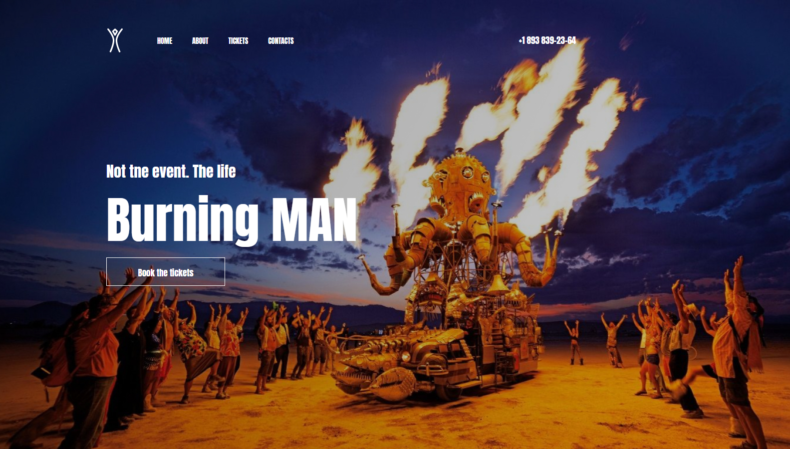

# 🔥 Burning Man Festival

> A modern, responsive landing page for the Burning Man festival event

[](https://html.spec.whatwg.org/)
[](https://www.w3.org/Style/CSS/)
[](LICENSE)

---

## 📸 Preview

<p align="center">
  
</p>

---

## 📖 About

A modern, responsive landing page for the Burning Man festival. Designed to capture the spirit of the event with bold typography, immersive imagery, and clean layout. Built with pure HTML and CSS -> no JavaScript, no frameworks.

**Features:**
- ✅ Fully responsive layout
- ✅ Bold, modern design
- ✅ Hero section with background image
- ✅ Event information section
- ✅ Google Maps-like info layout
- ✅ Contact & ticket links
- ✅ Clean typography with Google Fonts

---

## 📁 Project Structure
```
Burning-Man/
├── index.html
├── Manager/
│   ├── Styles/
│   │   └── Style.Css
│   ├── Icons/
│   │   └── Banner.png          # Preview image
│   └── Images/
│       ├── header.jpg          # Hero background
│       ├── logo.png
│       ├── last-img_1.png
│       ├── last-img_2.png
│       └── last-img_3.png
└── README.md
```